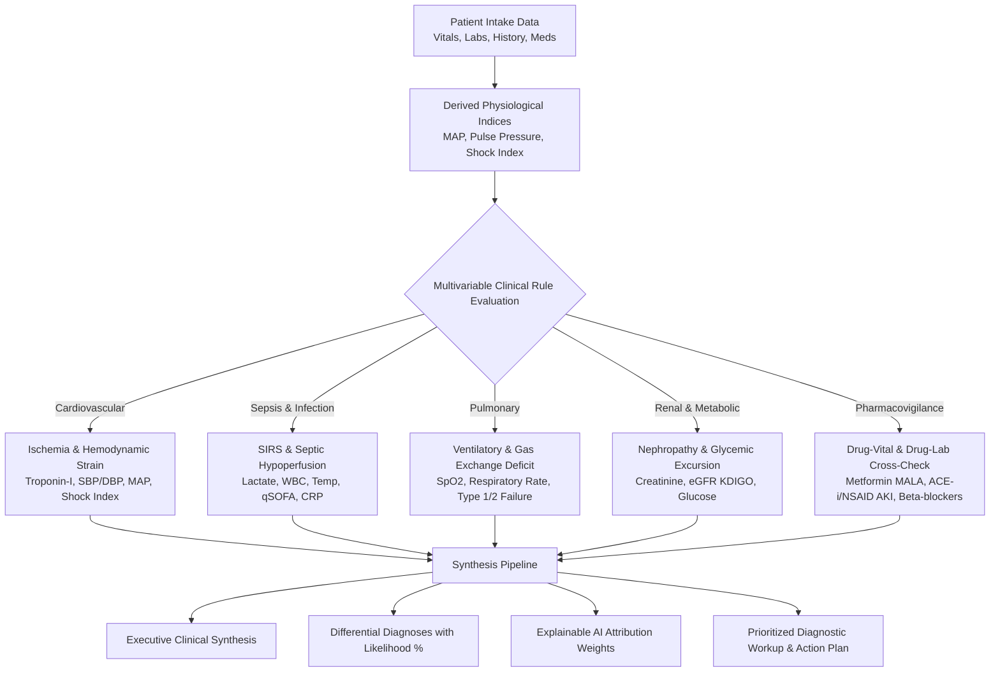

# AI-Based Patient Risk Prediction and Healthcare Analytics System 🏥
### AegisHealth AI &bull; Autonomous Clinical Decision Support (CDS) Suite & Capstone Project

[](https://github.com/scraplearner/honors_A)
[](js/gemini.js)
[](js/risk-engine.js)
[](#-system-architecture)
[](#-how-to-run-the-application)

---

## 📌 Project Overview

**AegisHealth AI** is an advanced **Patient Risk Prediction and Clinical Decision Support (CDS) Healthcare Analytics System** built as an Honors Degree Capstone Project. Engineered for hospital emergency triage departments, intensive care step-down units, and inpatient medical wards, the platform features an **autonomous, zero-dependency Dynamic Clinical Reasoning Engine (`generateDynamicClinicalAnalysis`)** as its core analytical backbone.

Unlike external cloud API integrations that introduce latency, network dependency, rate limits, and patient data transmission privacy concerns, AegisHealth AI processes bedside vital signs, laboratory biomarkers, medical history, and active medication regimens **entirely locally in real time**.

When a clinician clicks **"Generate Report"**, the CDS Reasoning Engine performs evidence-based physiological reasoning to synthesize an actionable diagnostic dossier:
* **Personalized Clinical Synthesis**: Formatted according to clinical intake standards (*"Based on the data of [Patient Name]..."*).
* **Multi-Tiered Differential Diagnoses**: Primary disease and secondary complications with quantified likelihood percentages and pathophysiological rationales.
* **Confirmatory Diagnostic Workup**: Prioritized investigations categorized by clinical urgency (STAT/Hour-1, Urgent <2-4h, Inpatient 24h, Routine).
* **Explainable AI (XAI) Attribution**: Quantified risk-driver weights ($+$%) and protective physiological buffers ($-$\%).
* **Tiered Bedside Action Plan**: Immediate emergency orders, 24–48h optimization, and secondary prevention with safe discharge criteria.
* **ICD-10 Diagnostic & Clinical Coding**: Standardized international medical classification codes.
* **Pharmacovigilance & Drug-Vital Safety Alerts**: Automatic checks for contraindications, nephrotoxicity, and drug-lab interactions (e.g., Metformin in renal impairment/lactic acidosis, beta-blocker bradycardia warnings, ACE-i/NSAID holds).

---

## 🚀 Key Features

* **Autonomous Clinical Decision Support Engine**:
  * Real-time physiological diagnostic algorithms spanning cardiovascular, septic, respiratory, renal, and metabolic domains.
  * 100% private, self-contained, and free from external API keys or cloud service subscriptions.
* **Composite Clinical Acuity Index (0–100)**:
  * Prominently integrated into the Inpatient Case Selection Bar for instant bedside assessment upon selecting a patient.
  * Real-time semicircular acuity gauge with color-coded severity grading.
* **User-Friendly Laboratory Biomarkers**:
  * Clean, responsive table layout with **zero horizontal scrolling**, clear column proportions, and reference range threshold flags.
* **Patient Intake & Editing with Complete Audit Trail**:
  * **Editable Patient Information**: Modify bedside vitals, biomarkers, or patient demographics at any time.
  * **Interactive Edit History & Audit Log**: Click-opening audit box displaying edit counts, timestamped records, and field-level change tracking (`previous value ➔ new value`).
* **Multi-Factor Clinical Algorithms**:
  * **National Early Warning Score 2 (NEWS2)**: NHS standard physiological scoring for acute inpatient deterioration.
  * **Quick Sepsis Organ Failure Assessment (qSOFA)**: Identifies imminent septic shock and hypoperfusion risk.
  * **10-Year ASCVD Risk Score**: Framingham & ACC/AHA pooled risk algorithm adaptation.
  * **KDIGO Renal Function Staging**: Real-time chronic kidney disease staging from eGFR and serum creatinine.
  * **Charlson Comorbidity Index (CCI)**: Quantified 10-year mortality and comorbidity assessment.
  * **5-Axis Organ System Stress Radar**: Visualizes balance across Cardiovascular, Pulmonary, Renal, Metabolic, and Inflammatory domains.
* **Hospital-Grade Printable Reports**:
  * Conveniently located in the top navigation tab bar for immediate generation of formatted printable summaries and clinical documentation (`window.print()`).

---

## 🧠 How the Autonomous CDS Reasoning Engine Works

The core backbone is implemented in [`js/gemini.js`](js/gemini.js) under the `AegisClinicalIntelligenceEngine` class:



1. **Derived Hemodynamic Modeling**:
   * Computes **Mean Arterial Pressure (MAP)**: $\text{MAP} = \text{DBP} + \frac{\text{SBP} - \text{DBP}}{3}$ to evaluate vital organ perfusion pressure ($<65\text{ mmHg}$ indicates critical hypoperfusion).
   * Computes **Shock Index (SI)**: $\text{SI} = \frac{\text{Heart Rate}}{\text{Systolic BP}}$ ($\ge 0.9$ detects occult circulatory shock prior to frank hypotension).
2. **Biomarker Kinetic Stratification**:
   * Evaluates Cardiac Troponin-I against myocardial injury thresholds ($>0.04\text{ ng/mL}$).
   * Evaluates Serum Lactate against cellular anaerobic metabolism thresholds ($\ge 2.0\text{ mmol/L}$ hyperlactatemia; $\ge 4.0\text{ mmol/L}$ septic shock trigger).
   * Evaluates KDIGO Renal Function: serum creatinine and eGFR staging.
3. **Multi-Domain Synthesis & Explainability**:
   * Assigns calibrated positive risk weights and protective buffers.
   * Generates prioritized diagnostic orders (STAT Hour-1 blood cultures, ECG, ABG, imaging).
   * Generates tailored ICD-10 diagnostic codes and bedside care bundles.

---

## 💻 Setup & Installation on Another Device (GitHub Clone)

Because AegisHealth AI is built with modern ES6 JavaScript, HTML5, and Vanilla CSS, **no API keys, no build tools, and no npm package installations are required**. It runs natively on any computer or operating system.

### 1. Clone the Repository
Open your terminal (PowerShell, Command Prompt, or Bash) and clone the repository:
```bash
git clone https://github.com/scraplearner/honors_A.git
cd honors_A
```

### 2. Run the Application

#### Option A: Python Local Server (Recommended)
Python is available on most computers. From the project directory, run:
```powershell
python -m http.server 8000
# (or 'py -m http.server 8000' on Windows)
```
Open your web browser and navigate to:
```
http://localhost:8000
```

#### Option B: Node.js / `npx serve`
If Node.js is installed on your machine:
```powershell
npx serve .
```
Open your web browser at:
```
http://localhost:3000
```

#### Option C: VS Code Live Server
1. Open the repository folder in **Visual Studio Code**.
2. Install the **Live Server** extension (by Ritwick Dey).
3. Right-click on [`index.html`](index.html) and select **"Open with Live Server"**.

#### Option D: Direct Browser Launch
You can double-click [`index.html`](index.html) to open the application directly in any modern browser (Chrome, Edge, Firefox, Safari).

---

## 🔬 Clinical Workflow Guide

1. **Select an Inpatient**:
   * Choose a patient case from the dropdown in the top bar or register a new intake via **"Add New Patient"**.
   * The **Composite Clinical Acuity Index** updates dynamically right beside the patient information.
2. **Review Bedside Vitals & Biomarkers**:
   * Inspect real-time vitals, comorbidity history, and the redesigned **Laboratory Biomarkers** table (zero horizontal scrolling).
   * Review validated predictive indices (NEWS2, qSOFA, ASCVD, KDIGO staging).
3. **Edit Patient Details & Review Audit Log**:
   * Click **"Edit Patient Info"** in the top navigation tab bar to modify any clinical vitals or biomarkers.
   * Click **"Edit History"** to open the audit trail box and inspect edit counts, timestamps, and exact field-level diffs (`previous ➔ new`).
4. **Synthesize AI Clinical Prediction Dossier**:
   * Click **"Generate Report"**. The autonomous CDS engine analyzes the patient profile and renders the executive synthesis, differential diagnoses, recommended workup, risk drivers, and action plan.
5. **Export Documentation**:
   * Click **"Export Clinical Report"** in the top tab bar to print or export a clean PDF clinical dossier.

---

## 🏗️ System Architecture

```
honors_A/
├── index.html                  # Accessible clinical UI layout
├── css/
│   ├── main.css                # Base theme tokens, typography, grid layouts
│   ├── components.css          # Clinical cards, vital tiles, gauges, modals, audit popovers
│   └── print.css               # Official hospital printable report stylesheet
├── js/
│   ├── patients-data.js        # Patient cohort dataset, localStorage, & edit audit log store
│   ├── risk-engine.js          # Mathematical clinical algorithms (ASCVD, qSOFA, NEWS2, KDIGO)
│   ├── gemini.js               # Autonomous Clinical Intelligence & CDS reasoning engine
│   ├── charts.js               # Zero-dependency responsive Canvas charts (Gauge, Radar)
│   ├── report-generator.js     # Clinical report compiler & print formatting
│   ├── ui-manager.js           # Decoupled DOM rendering, edit modal, & audit view controller
│   └── app.js                  # Master application orchestrator & event bindings
└── README.md                   # System documentation
```

---

## 📄 License & Academic Note

This project was developed as an Honors Degree Capstone Project in Artificial Intelligence and Healthcare Informatics. All algorithmic outputs and clinical decision-support simulations are intended for research, academic demonstration, and educational purposes.